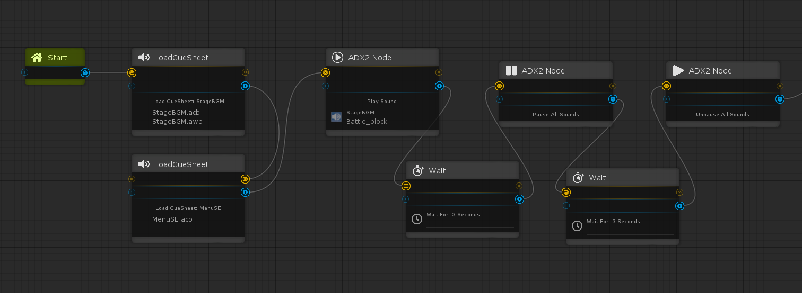
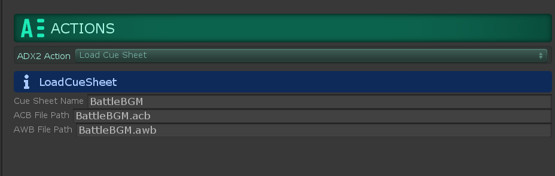
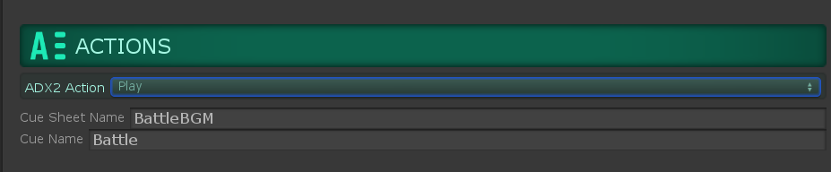
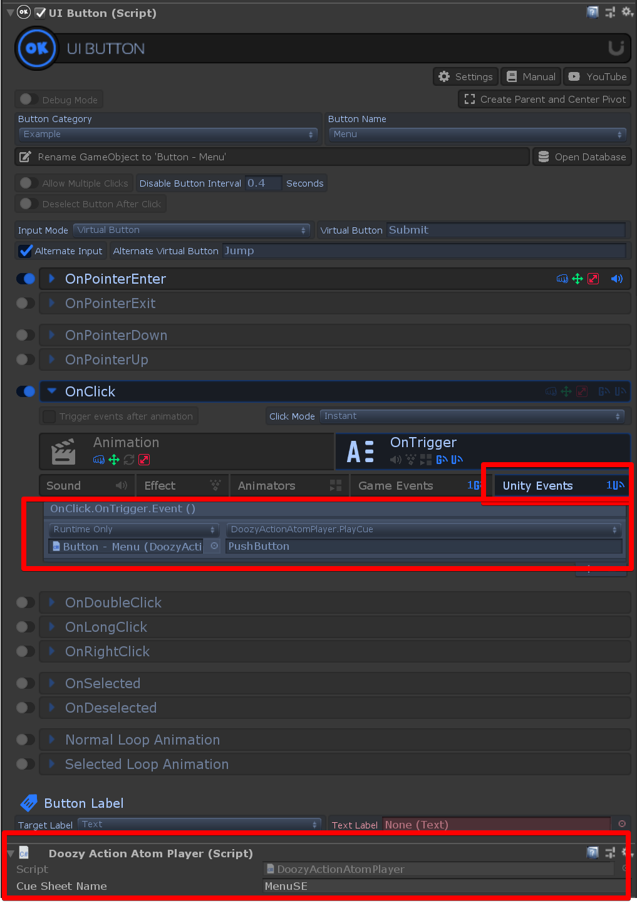

# ADX2 for Doozy UI
Doozy UIのノードエディタNodyからADX2の各機能を使うための拡張

## 動作確認環境
* Unity 2018.4.18f1
* Doozy UI 3.1.2
* CRI ADX2 LE SDK 2.10.05

## 使い方

### 準備
通常のADX2データ再生と同じように、シーンの中にCriAtomクラス(デフォルトではCRIWAREゲームオブジェクト)、CriWareInitializer、CriWareErrorHandlerクラスを用意してください。

### キューシートロード用のノードを作る
* Nodyの右クリックコンテキストメニューから「ADX2」を選択してノードを配置
* アクションを「Load Cue Sheet」に変更
* キューシートの名前とパスを指定

### キュー再生用のノードを作る

* Nodyの右クリックコンテキストメニューから「ADX2」を選択してノードを配置
* アクションを「Play」に変更
* キューシート名とキュー名を指定
* 当該キューシートのロード処理ノードのあとにこのノードを接続する

## その他のアクション
ADX2ノードは以下のアクションが実行可能です

* Stop
* Mute
* UnMute
* Pause
* UnPause

## 再生に関する仕様
Playアクションが処理されると、シングルトンクラス「DoozyAtomSourceManager」が生成されます。
これはADX2ノードから再生される音を処理するためのCriAtomSourceインスタンスを管理するクラスです。
新しいキューシートがロードされるたびに、ひとつのCriAtomSourceを生成します。

## Doozy UIのボタン入力からADX2を鳴らす
Dozzy UIのボタン入力やUI遷移を管理するUIViewクラスには、アクションの際にUnityEventを発行できます。
そのイベントにADX2のキュー再生をフックする単純なスクリプトDoozyActionAtomPlayer.csを同梱しています。

DoozyAtomSourceManagerのインスタンスをシーン内に先に用意します。
また、再生前にCriAtomインスタンスでacbファイルをあらかじめ登録しておくか、Nodyでacbファイルをロードしておく必要があります。
DoozyActionAtomPlayerのcueSheetNameフィールドにキューシート名を指定し、UnityEventの引数にキュー名を指定することでDoozy UIのアクションのタイミングでADX2データを再生できます。

# ライセンス
MIT License